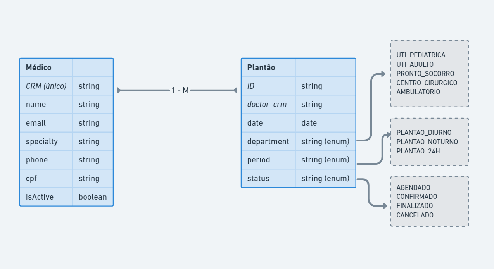

# Agendamento de plantões médicos

### Executar a aplicação
```bash
pip install -r requirement.txt
uvicorn app.main:app --reload
```

#### :bulb: Acesse o swagger: http://localhost:8000/docs
<br />

## [Regras de negócio]


    -> Cadastro de médico
        * CRM deve ser único
    -> Agendamento de plantão
        * Um plantão pode ter a escala:
            - plantão diurno (07h às 19h)
            - plantão noturno (19h às 07h)
            - plantão 24h
        * Um plantão tem que estar atrelado a um setor:
            - UTI - pediátrica
            - UTI - adulto
            - Pronto Socorro
            - Centro Cirúrgico
            - Ambulatório
        * Plantão só pode ser agendado se:
            - médico não está bloqueado
            - médico ainda não tem platão agendado para a data

    -> Troca de médico no plantão
        * O médico que vai entrar na troca não pode ter plantão agendado para a data e não pode estar bloqueado

### Funcionalidades
- [x] Cadastro de médicos
- [x] Listagem de médicos
- [x] Busca de médico por CRM
- [x] Pesquisar médicos por nome
- [x] Bloquear e desbloquear médico
- [x] Agendar plantão
- [x] Listar todos os plantões
- [x] Filtrar plantões agendados por data, status, periodo e departamento
- [x] Buscar plantões do médico por CRM
- [x] Troca de médico no plantão
